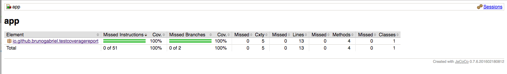

# Test Coverage Report Using jacoco in Android
This is a very simple example how to use jacoco to generate a nice report in html/xml/csv of your test suite (including instrumental and unit).

I used a some examples to create this like official jacoco page, gradle official page, some github of developers, medium etc.

Thank you community

Showcase
---

  

